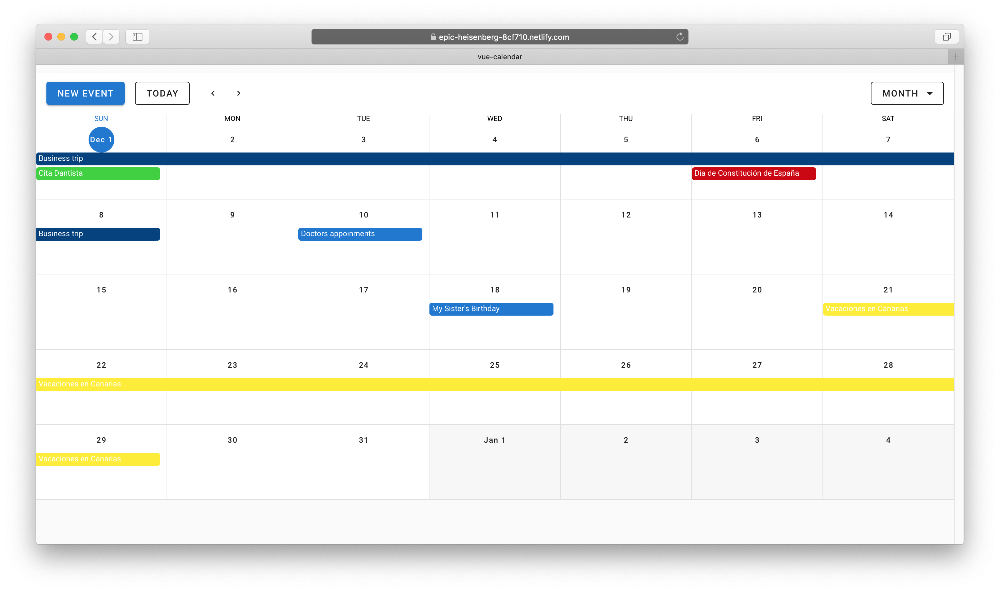
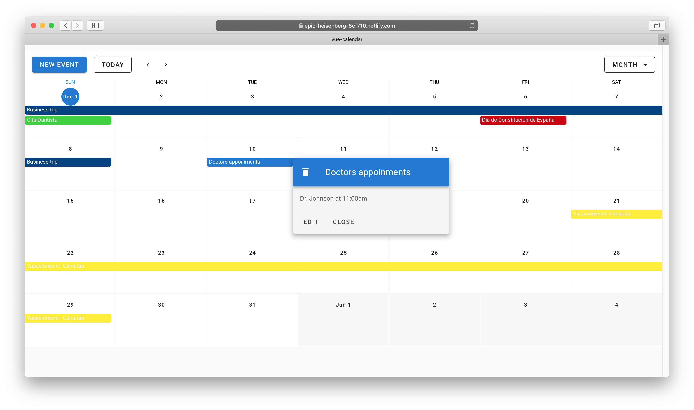
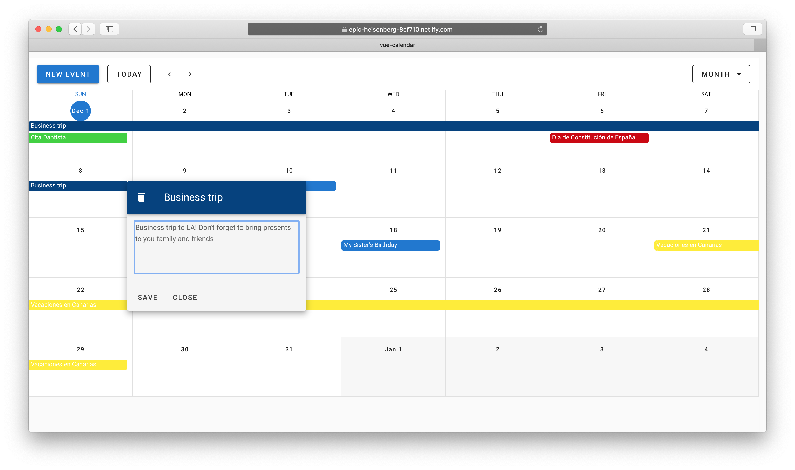
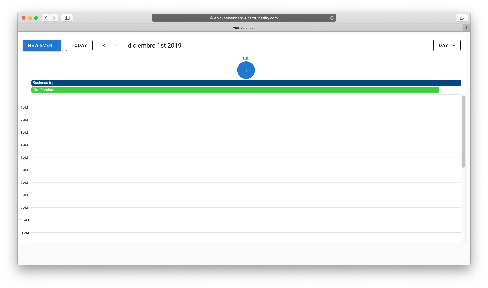

# vue-calendar

[](https://github.com/lytves/vue-basic-authentication-example/blob/master/LICENSE)
[](https://vuejs.org/)
[](https://app.netlify.com/sites/epic-heisenberg-8cf710/deploys)

It's a simple Vue.js web single-page application with implementation of your own events calendar on **vuetify**
 with **firebase databases** storage to CRUD operations and **vue-textarea-autosize**.
 
+ [Vuetify](https://vuetifyjs.com/ru/)
+ [Firebase](https://firebase.google.com/)
+ [Vue-textarea-autosize](https://www.npmjs.com/package/vue-textarea-autosize)

Project was created according the video blog from the Youtube channel **"Traversy Media"** - [Build a Calendar With Vue, Vuetify & Firebase](https://www.youtube.com/watch?v=2NOsjTT1b_k).
You will find there a quiet more project author's architecture explanations.

The project was published on Netlify, you can watch its live demo here https://epic-heisenberg-8cf710.netlify.com/

#### Setting Up Firebase:
+ Set up a new project in Firebase with Database enabled.
+  Implement the following Firebase SDK scripts in main.js:

```javascript
import firebase from "firebase";
firebase.initializeApp({
  apiKey: "",
  authDomain: "",
  databaseURL: "",
  projectId: "",
  storageBucket: "",
  messagingSenderId: "",
  appId: ""
});

export const db = firebase.firestore();
```

#### Screenshots:
 
 
 
 
 